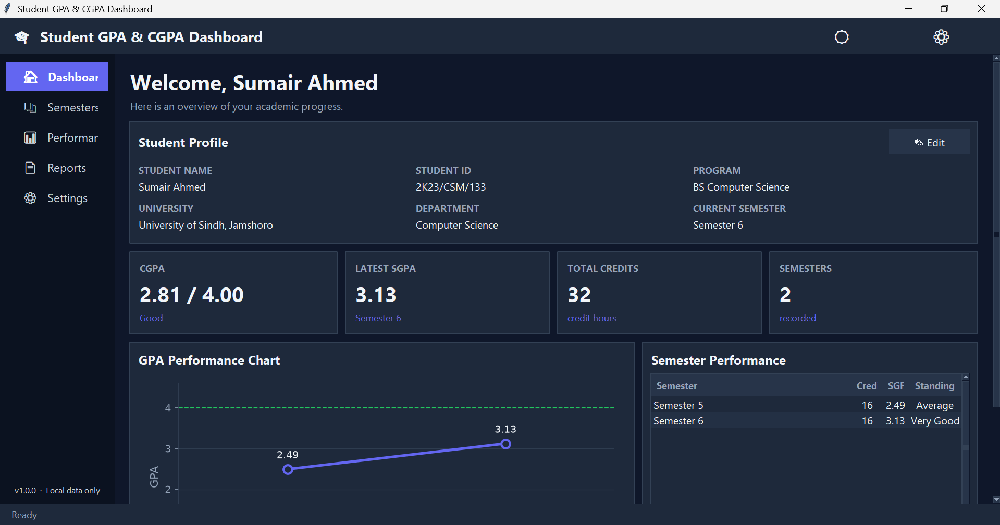
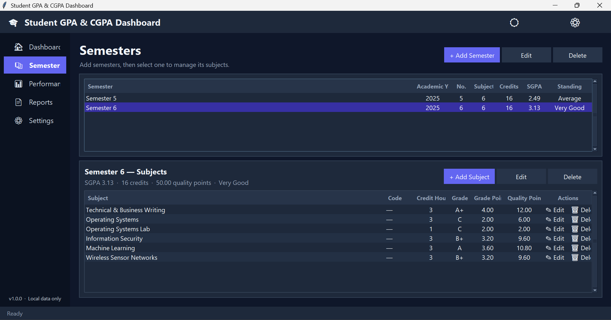
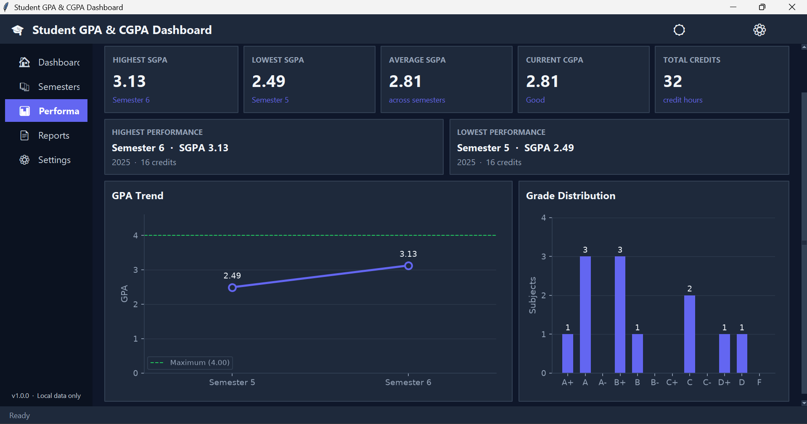
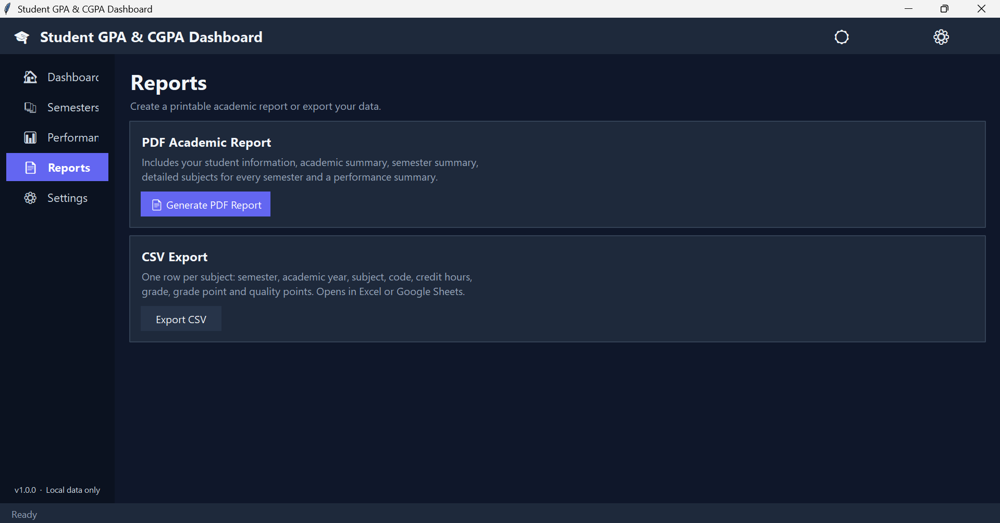

<div align="center">

# 🎓 Student GPA & CGPA Dashboard

**A modern desktop app to track semesters, subjects, SGPA and CGPA, with charts and PDF reports.**


</div>

---

## 📸 Screenshots

<div align="center">

### Dashboard


<br>

### Dashboard Light Mode


<br>

### Semesters & Subjects


<br>

### Performance


<br>

### PDF Academic Report


</div>

---

## ✨ Features

| | Feature |
|---|---|
| 📊 | **Dashboard** with student profile, CGPA, latest SGPA, total credits and semester count |
| 🧮 | **Accurate GPA maths**: SGPA per semester and credit-weighted CGPA |
| 📚 | **Semesters & subjects**: add, edit and delete, with double-click editing and the Delete key |
| 📈 | **Charts**: GPA trend line and grade distribution (Matplotlib) |
| 🌗 | **Dark and light themes**, remembered between launches |
| 📄 | **PDF academic report** with header, footer, page numbers and tables |
| 📤 | **CSV export** of every subject |
| 💾 | **JSON backup and restore** with validation |
| 🗄️ | **SQLite storage** with foreign keys and parameterised queries |
| ✅ | **Unit tests** using the built-in `unittest` module |
| 🔒 | **100% local**: no internet, no accounts, no tracking |

---

## 🛠️ Technologies

| Purpose | Tool |
|---|---|
| Language | Python 3.11+ |
| GUI | Tkinter / ttk |
| Database | SQLite (`sqlite3`) |
| Charts | Matplotlib |
| PDF reports | ReportLab |
| Testing | `unittest` |

---

## 🚀 Getting Started (Windows)

**Requirements:** Python 3.11 or newer from [python.org](https://www.python.org/downloads/) (tick *Add Python to PATH*).

```bash
git clone https://github.com/Sumair2005/Student-CGPA-GPA-Dashboard.git
cd Student-CGPA-GPA-Dashboard
python -m venv venv
venv\Scripts\activate
pip install -r requirements.txt
python main.py
```

The database file `student_gpa.db` is created automatically on first launch.

> **No Git?** Click the green **Code** button on GitHub, choose **Download ZIP**, extract it, then run the commands from `python -m venv venv` onward inside the extracted folder.

**Next time you want to run it:**

```bash
venv\Scripts\activate
python main.py
```

---

## 🧭 How to Use

1. **Dashboard**: click **Edit** and enter your name, student ID, program and university.
2. **Semesters**: click **+ Add Semester**, then select it in the table.
3. **Subjects**: click **+ Add Subject** and enter the name, credit hours and grade.
4. **Performance**: view your GPA trend and grade distribution.
5. **Reports**: generate a PDF report or export a CSV.
6. **Settings**: switch themes, back up your data or restore it.

**Keyboard shortcuts:** `Ctrl+1` to `Ctrl+5` switch pages, `Enter` or double-click edits a row, `Delete` removes the selected row.

---

## 🧮 GPA Formulas

**Quality points** for a subject:

```text
Quality Points = Credit Hours × Grade Point
```

**SGPA** (semester GPA):

```text
SGPA = Total Quality Points in the semester / Total Credit Hours in the semester
```

Example (three subjects, 3 credit hours each):

```text
Subject 1: grade A   ->  3 x 3.60 = 10.80
Subject 2: grade B+  ->  3 x 3.20 =  9.60
Subject 3: grade A-  ->  3 x 3.20 =  9.60

Total quality points = 30.00
Total credit hours   = 9
SGPA = 30.00 / 9 = 3.33
```

**CGPA** (cumulative GPA) is weighted by credit hours. It is *not* the average of the SGPAs:

```text
CGPA = Total Quality Points across all semesters / Total Credit Hours across all semesters
```

Example: Semester 1 has SGPA 3.50 over 18 credits and Semester 2 has SGPA 3.80 over 21 credits.
CGPA = (3.50 × 18 + 3.80 × 21) / 39 = **3.66**. A simple average would wrongly give 3.65.

---

## 🎯 Grade Scale

The scale used by this project (edit it in `core/grading.py`):

| Grade | Grade Point | Quality Points (3 credit hours) |
|-------|-------------|---------------------------------|
| A+    | 4.00        | 12.00                           |
| A     | 3.60        | 10.80                           |
| A-    | 3.20        | 9.60                            |
| B+    | 3.20        | 9.60                            |
| B     | 2.80        | 8.40                            |
| B-    | 2.40        | 7.20                            |
| C+    | 2.20        | 7.20                            |
| C     | 2.00        | 6.00                            |
| C-    | 1.80        | 5.40                            |
| D+    | 1.50        | 4.50                            |
| D     | 1.00        | 3.00                            |
| F     | 0.00        | 0.00                            |

---

## 🧪 Testing

```bash
python -m unittest discover
```

---

## 📁 Project Structure

```text
Student-CGPA-GPA-Dashboard/
|-- main.py
|-- database/
|   `-- database.py
|-- core/
|   |-- calculator.py
|   |-- validators.py
|   `-- grading.py
|-- ui/
|   |-- app.py
|   |-- dashboard.py
|   |-- semesters.py
|   |-- subjects.py
|   |-- performance.py
|   |-- reports.py
|   |-- settings.py
|   |-- charts.py
|   |-- widgets.py
|   `-- theme.py
|-- reports/
|   `-- pdf_report.py
|-- utils/
|   |-- export.py
|   `-- helpers.py
|-- tests/
|   |-- test_calculator.py
|   |-- test_validators.py
|   `-- test_database.py
|-- assets/
|-- screenshots/
|-- requirements.txt
|-- LICENSE
`-- .gitignore
```

---

## 🔒 Privacy

All data stays on your computer in `student_gpa.db`. The database is listed in `.gitignore`, so personal student data is never committed by accident.

---

## 🗺️ Roadmap

- [ ] University-specific grading scales
- [ ] Multiple grading systems (percentage, 5.0 scale)
- [ ] Optional cloud synchronisation
- [ ] Login system for multiple students
- [ ] Mobile version

---

## 📜 License

Released under the [MIT License](LICENSE).

---

<div align="center">

Built by [Sumair Ahmed Mangi](https://github.com/Sumair2005) · If you find this useful, give it a ⭐

</div>